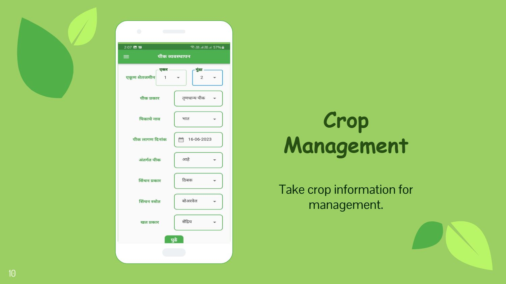
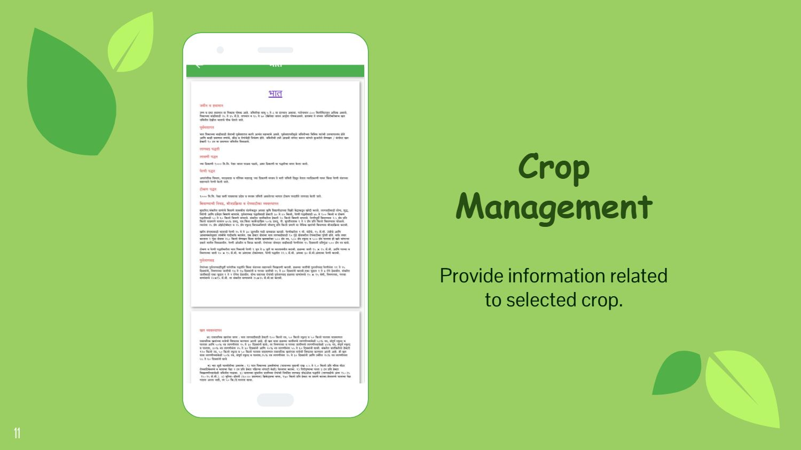
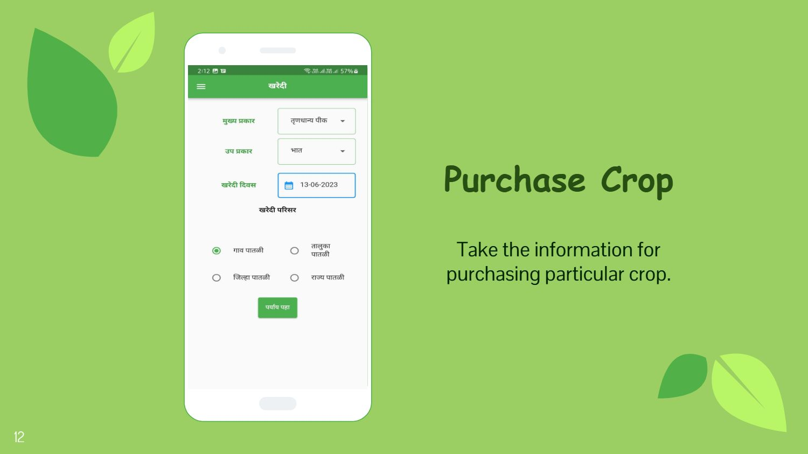

# 🌱 Dharati

An opinionated, user-friendly Flutter app for agricultural assistance — phone auth, dosage calculation, crop management and marketplace services like buy and sell services, crops etc.

**Status:** v1.0.0 — Completed ✅

**Main features**

- 👤 **User Profile** — store and manage user details and preferences.
- ⚖️ **Dosage Calculator** — calculate correct pesticide/fertilizer dosages safely ([lib/screens/dosageCalculator.dart](lib/screens/dosageCalculator.dart)).
- 🌾 **Crop Management** — manage crops, schedules and info (add/update crop data).
- 🛒 **Marketplace** — listing and discovery for selling/purchasing products and farming services.
- 🔧 **Service Requests** — request and offer farm labor and farm-related services.

**Highlights**

- 📱 Phone authentication (OTP)
- 🔐 Firebase integration and services ([lib/services/FirebaseAllServices.dart](lib/services/FirebaseAllServices.dart))
- 🧭 Navigation drawer and utility widgets ([lib/widgets/NavDrawer.dart](lib/widgets/NavDrawer.dart))

**Screens**

<p align="center">
  
  
  
</p>

**Project structure (important files)**

- **App entry:** [lib/main.dart](lib/main.dart)
- **Screens:** [lib/screens/phone.dart](lib/screens/phone.dart), [lib/screens/otp.dart](lib/screens/otp.dart), [lib/screens/userDetails.dart](lib/screens/userDetails.dart), [lib/screens/dosageCalculator.dart](lib/screens/dosageCalculator.dart)
- **Services:** [lib/services/FirebaseAllServices.dart](lib/services/FirebaseAllServices.dart), [lib/services/firebase_options.dart](lib/services/firebase_options.dart)
- **Widgets:** [lib/widgets/NavDrawer.dart](lib/widgets/NavDrawer.dart), [lib/widgets/showSnackBar.dart](lib/widgets/showSnackBar.dart)
- **Assets:** [assets/JSON%20Files/Districts.json](assets/JSON%20Files/Districts.json), [assets/Screens/crop-management.jpg](assets/Screens/crop-management.jpg)

**Prerequisites**

- Install Flutter (stable channel). See the official Flutter docs for your OS.
- Android SDK / Android Studio for Android builds.
- Xcode for iOS builds (macOS only).
- Firebase CLI (optional) if you want to manage remote Firebase resources.

**Local setup**

1. Clone the repo and open it in your preferred IDE (VS Code / Android Studio).
2. Fetch packages:

    ```bash
    flutter pub get
    ```

3. Ensure platform Firebase files exist (already included here):

    - Android: app/google-services.json exists at android/app/google-services.json
    - iOS: GoogleService-Info.plist exists at ios/Runner/GoogleService-Info.plist

4. Run the app (choose device/emulator):

    ```bash
    flutter run
    ```

**Notes about Firebase**

- The repo includes `google-services.json` and `GoogleService-Info.plist`. If you replace the Firebase project, swap these files and update `lib/services/firebase_options.dart` using the FlutterFire CLI or manual configuration.
- Phone auth requires that your Firebase project has Phone Authentication enabled and the app package/bundle IDs match the registered app.

**How to test key flows**

- Phone -> OTP: Open the app, enter a phone number on the phone screen, then verify with OTP flow.
- Dosage: Open the Dosage Calculator screen and input values to validate computation.
- Marketplace: Try listing an item or searching for a product/service.

**Development tips**

- Use `flutter analyze` to run static analysis.
- Use `flutter format .` to keep code style consistent.
- The app stores JSON lists for districts/talukas/villages in `assets/JSON Files` — update those if you need new locations.

**Contribution**

- Open an issue for bugs or feature requests.
- Send a pull request with a clear description of changes and test steps.

**License**

- See [LICENSE.md](LICENSE.md)

---

Made with 🌾 and ❤️ — Happy farming!